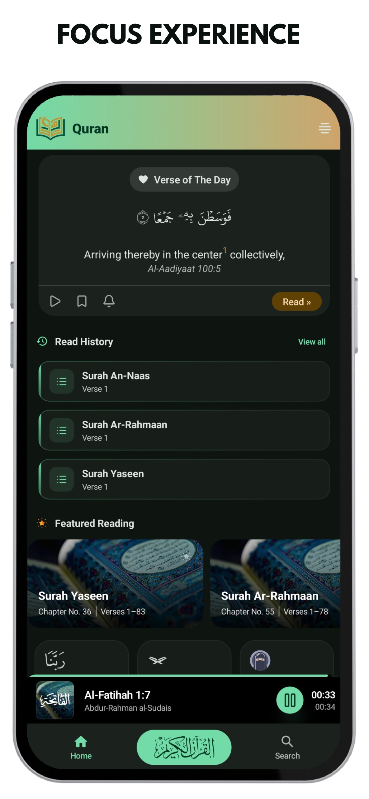
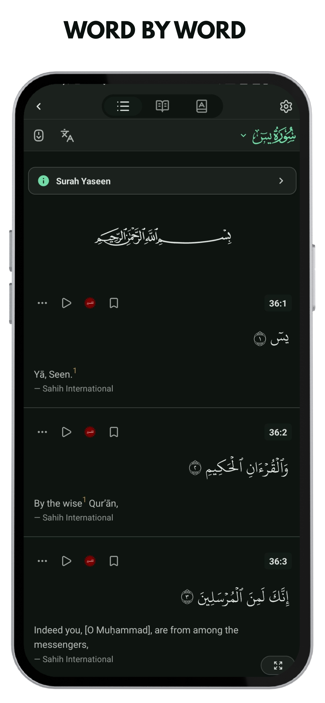
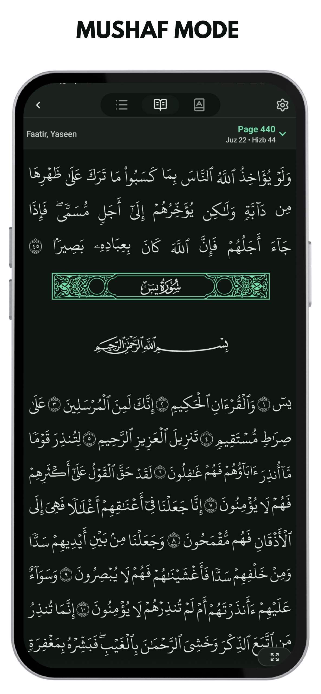
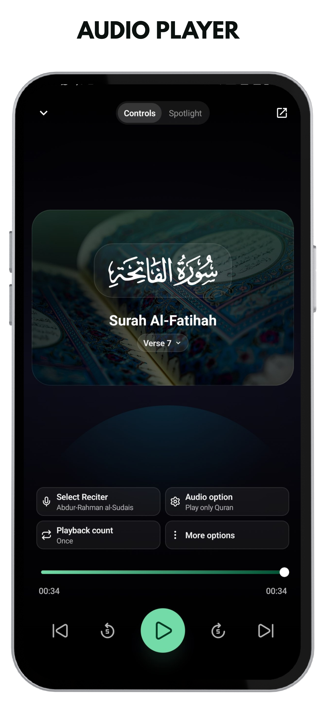
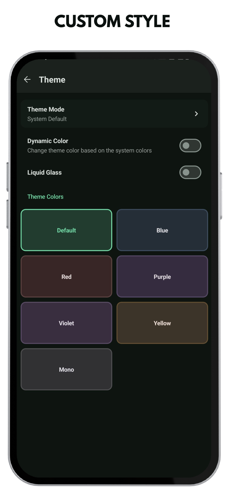

<div align="center">

  

  # 📖 Quran


  **A modern, ad-free, and privacy-focused Quran application for Android.**

  [](https://github.com/kumanode/Quran/blob/master/LICENSE)
  [](https://github.com/kumanode/Quran/releases)
  [](https://android.com)

  <br />

  > ℹ️ **Fork Notice:** This repository is a customized fork of [QuranApp](https://github.com/AlfaazPlus/QuranApp) by AlfaazPlus, updated with Jetpack Compose UI, Material 3, and Dhikr & Digital Tasbih features.

</div>

---

## 📱 Screenshots

<div align="center">
  
  
  
  
  
</div>

---

## ✨ Features

- 🚫 **Ad-Free & Privacy First**: Zero ads, no tracking, and no invasive permissions required.
- 📙 **30+ Translations & Tafsirs**: Supports Indonesian, English, Arabic, Malay, Urdu, and more.
- 🎙️ **Audio Recitations**: Stream or download recitations from world-renowned Qaris.
- 📿 **Dhikr & Digital Tasbih**: Daily Dhikr & Dua collection with an interactive counter.
- 🔤 **Multiple Scripts & Modes**: Uthmani script, Indopak font, and traditional Mushaf mode.
- 🎨 **Material 3 UI**: Clean Jetpack Compose interface supporting dark and light themes.
- 🔖 **Bookmarks & Search**: Fast full-text search, verse bookmarking, and reading history.

---

## 🛠️ Tech Stack

- **UI**: Jetpack Compose & Material 3
- **Database**: Room Database & DataStore
- **Audio Engine**: AndroidX Media3 (ExoPlayer)
- **Language**: Kotlin (Coroutines, Flow)

---

## 🚀 Quick Start

```bash
git clone https://github.com/kumanode/Quran.git
cd Quran
./gradlew assembleDebug
```

---

## 📄 License & Credits

- **Upstream Project**: Forked from [AlfaazPlus/QuranApp](https://github.com/AlfaazPlus/QuranApp).
- **License**: Distributed under the [GNU General Public License v3.0](https://github.com/kumanode/Quran/blob/master/LICENSE).
